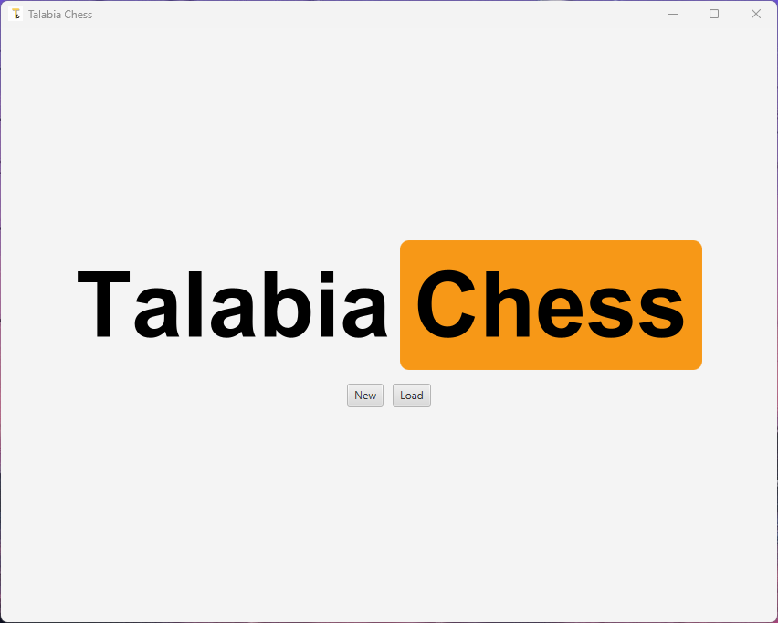
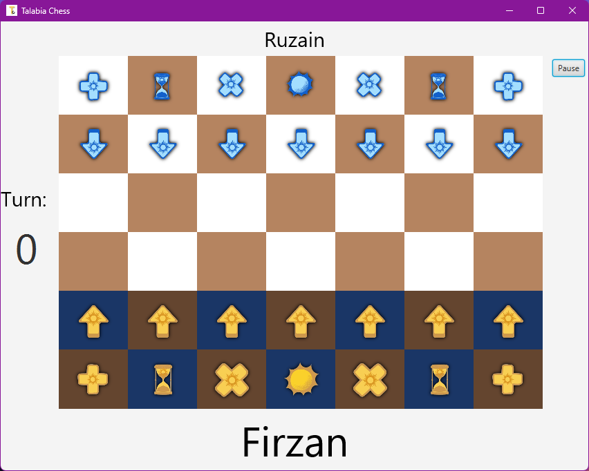
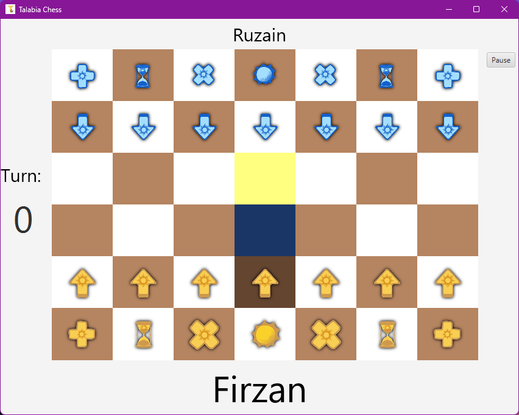
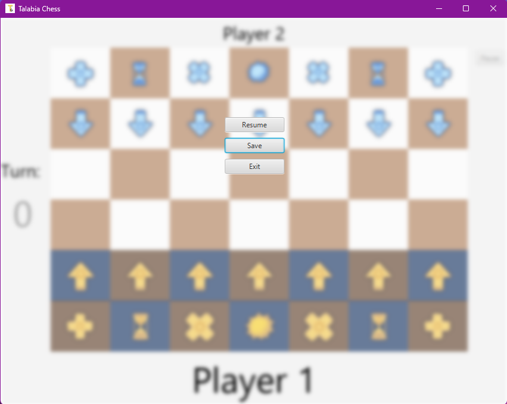

# TalabiaChess
An Object-Oriented Application Design project- a "variation" of chess which is called Talabia Chess. TalabiaChess is a chess game developed in Java with JavaFX for the user interface. It provides a simple, interactive chessboard where players can play chess.

## Features

- Interactive chessboard with draggable pieces
- User-friendly interface using JavaFX
- Game status updates
- Clean and responsive design

## Screenshots

Here are some screenshots of TalabiaChess:

  
*Main menu of the game*

  
*Game in progress with pieces on the board*

  
*Piece's move on the board*

  
*Pause Menu during the game*
